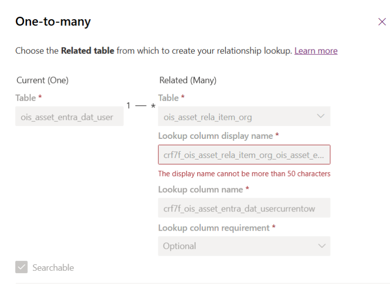
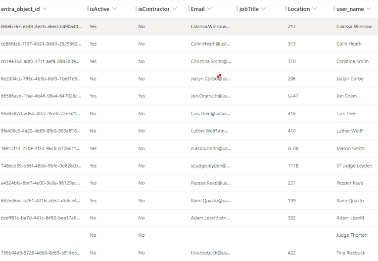
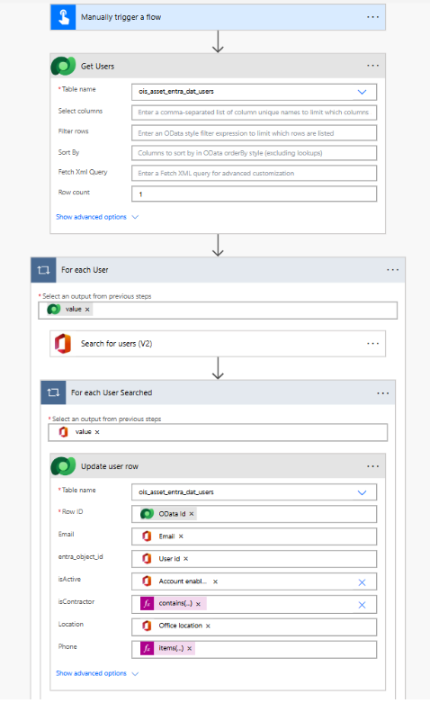

## Connecting Assets to Users

**Matthew Hung & Sharlet Claros**

IT Asset Management Project

**USTC Automation Team**

**AT-128**

## Abstract

The purpose of this document is to outline and describe how the relationship between the user table and the item-related assets table within Dataverse was established in order to connect assets to users. In addition, we will outline the creation of a data connection via Microsoft Flow to further populate user information.

Through the work involved in connecting assets to users, we are able to have a more complete dataset overall. Through this connection, with the established user table, we can properly generate related user information for each user for any particular asset. Future documents will detail how this relationship will be leveraged in downstream processes and integrations.

## Table Structure

Our assets table (ois_asset_rela_item_org) is related to our user table (ois_asset_entra_dat_user) through the lookup field named ois_asset_entra_dat_userCurrentOwnerLookup.

Figure 1: Relationship between ITAM user table (left) and ITAM item (right)

Figure 2: ITAM user table with example of data backfilled

## Initial Population of Table

After the population from usernames, the created Microsoft flow (Figure 3) proceeds to populate the remaining user information within the user table. This flow leverages connectors in Power Automate to retrieve and populate details such as office location, job title, and other relevant attributes. From there, we are able to populate and establish connections between the user table and the related organizational item table. Future sprints will focus on keeping information in the user table up to date.

Figure 3: Structure of our flow to fill in the user table

Starting from the top, the "List Rows" action retrieves all users within the user table. For each user retrieved, the flow obtains user information from Microsoft Graph using the Office 365 connector. Since this connector returns data in a list format, an additional "Apply to Each" loop is used to update the corresponding user record within the user table.

## Field Mappings

| ITAM Field               | Graph (user) Field                                         |
|--------------------------|------------------------------------------------------------|
| `(string) fullName`      | (string) DisplayName                                     |
| `(string) Email`         | (string) userPrincipalName                               |
| (string) jobTitle      | (string) jobTitle                                        |
| (string) Phone         | (string) mobilePhone                                     |
| (string) Location      | (string) officeLocation                                  |
| (bool) isContractor    | (bool) If {userPrincipalName} contains “.ctr” - formula  |
| (bool) isActive        | (bool) accountEnabled                                    |

**Table 1: Mapping of fields between ITAM user table and Graph**

## IsContractor Field

Field mappings between our ITAM user table and graph table are all one to one except for IsContractor. Within the created Microsoft flow, this field is calculated using a formula to ensure that any user who is a contractor is accurately represented as such. The formula is as follows: If user email contains “.ctr” three characters to the right of “@” within email then True else False.

## Results

With the user table now backfilled and the lookup column established, we can begin leveraging the user table and its relationships to the item table.
